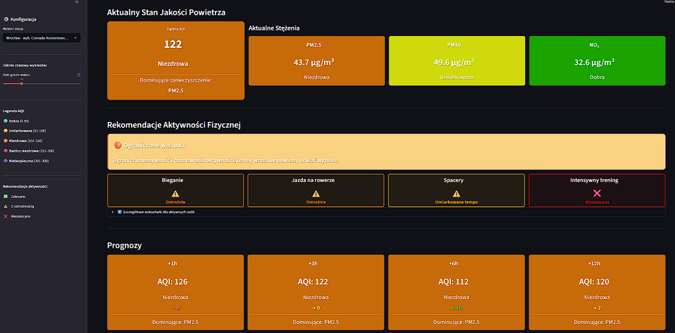
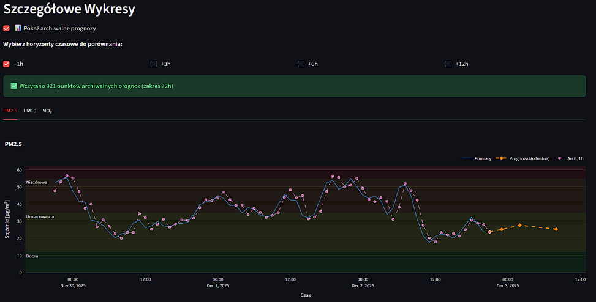

# System Predykcji Jakości Powietrza — Wrocław
> Engineering Thesis | Politechnika Wrocławska

System predykcji stężeń zanieczyszczeń powietrza (PM10, PM2.5, NO2) dla wybranej stacji we Wrocławiu
z wykorzystaniem sieci neuronowych LSTM oraz modelu XGBoost. Aplikacja webowa
skierowana do sportowców i osób aktywnych fizycznie planujących aktywność na zewnątrz.

---

## O projekcie

Praca porusza problematykę prognozowania jakości powietrza w kontekście planowania
aktywności fizycznej na zewnątrz. Celem było opracowanie systemu umożliwiającego
prognozowanie stężeń PM10, PM2.5 oraz NO₂ w horyzontach 1, 3, 6 i 12 godzin.

Porównano skuteczność dwóch modeli: **LSTM** oraz **XGBoost**. Ewaluacja wykazała,
że XGBoost osiągnął porównywalne, a najczęściej lepsze wyniki przy znacznie krótszym
czasie treningu — dlatego został wybrany do finalnej implementacji.

Dane historyczne obejmują lata 2020–2025 ze stacji pomiarowej we Wrocławiu
(GIOŚ) oraz dane meteorologiczne (OpenMeteo).

> This thesis addresses the problem of air quality forecasting in the context of
> planning outdoor physical activity. The system cyclically collects data, generates
> forecasts, and presents them via a web interface, offering users recommendations
> and information enabling informed decisions regarding outdoor physical activity.

---

## Wyniki — XGBoost (PM2.5, zbiór testowy)

| Horyzont | MAE [µg/m³] | RMSE | R²   | MAPE [%] |
|----------|-------------|------|------|----------|
| 1h       | 1.51        | 3.82 | 0.93 | 7.43     |
| 3h       | 2.78        | 5.84 | 0.84 | 14.21    |
| 6h       | 3.78        | 7.46 | 0.73 | 19.67    |
| 12h      | 4.67        | 9.01 | 0.61 | 23.68    |
| **Średnia** | **3.18** | **6.53** | **0.78** | **16.25** |

---

## Technologie

- **ML/DL:** TensorFlow/Keras (LSTM), XGBoost, Optuna
- **Backend:** Python, APScheduler, SQLite
- **Dashboard:** Streamlit
- **Dane:** GIOŚ API, OpenMeteo API

## Funkcje dashboardu

- Predykcja PM10, PM2.5 i NO2 dla horyzontów 1h, 3h, 6h, 12h
- Indeks jakości powietrza (AQI) z dominującym zanieczyszczeniem
- Rekomendacje aktywności fizycznej na zewnątrz
- Wykresy historyczne z nałożonymi predykcjami
- Automatyczna aktualizacja danych co godzinę

## Screenshots

